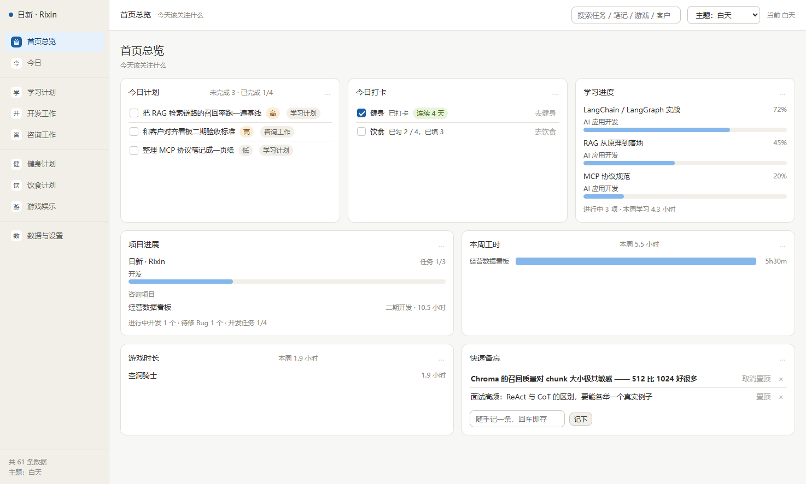
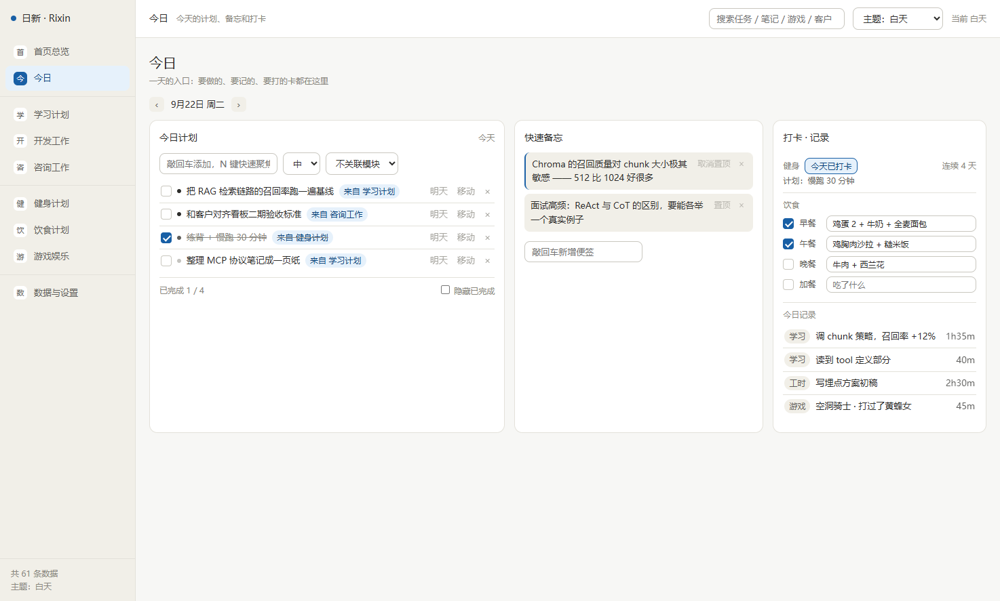
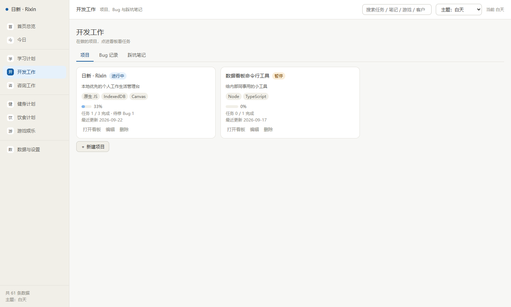
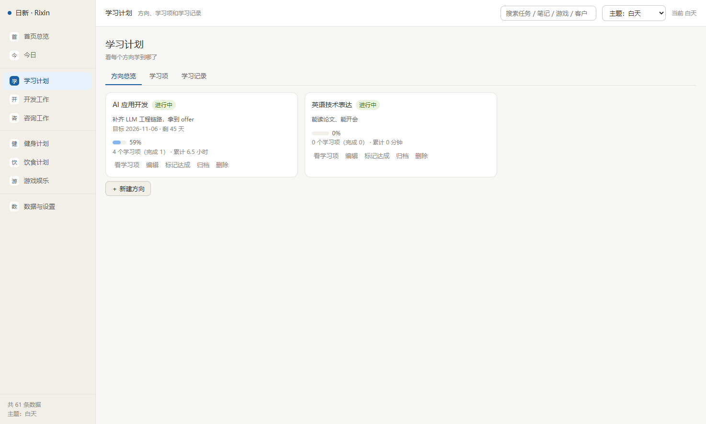
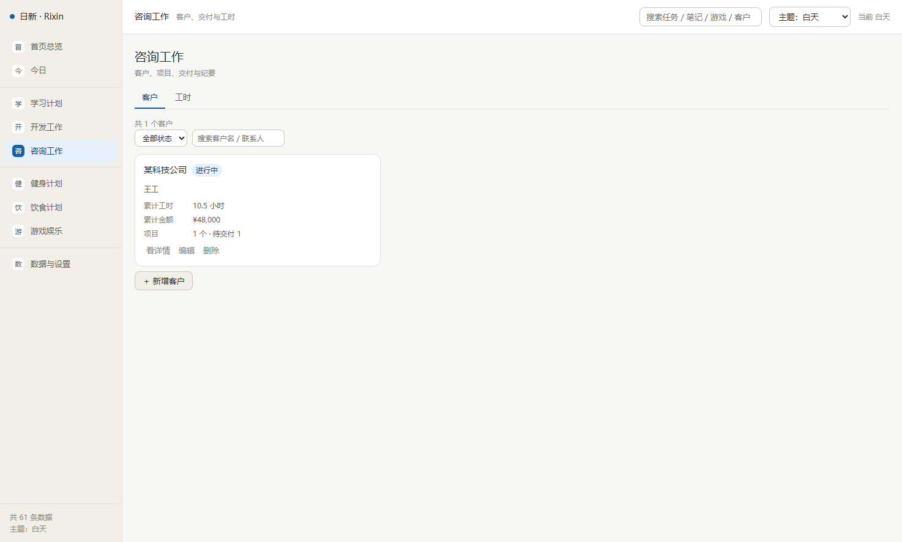
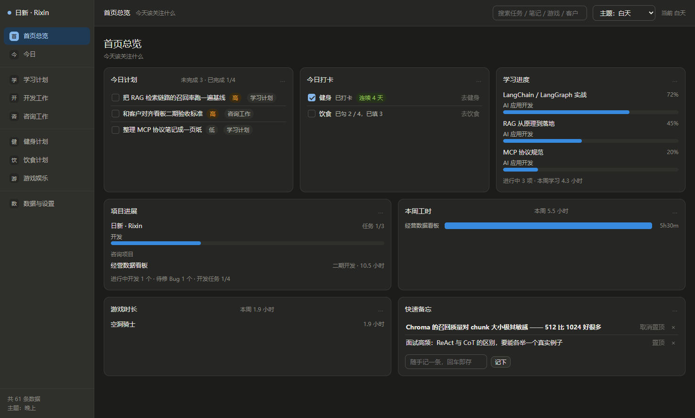

# 日新 · Rixin

> 一个**本地优先**的个人工作生活管理台：九个模块收纳学习、开发、咨询、健身、饮食与娱乐，数据只留在你自己的电脑上。
> 双击 `index.html` 就能用 —— 不安装、不构建、不注册、不联网。

<p align="center">
  
</p>

<p align="center">
  <b>零依赖</b> · <b>零构建</b> · <b>数据不出本机</b> · <b>334 个自动化用例全绿</b>
</p>

---

## 摘要 / Abstract

**Rixin** is a local-first personal workbench that runs entirely in your browser from a single
`index.html`. It bundles nine purpose-built modules — study plans, engineering work, consulting
engagements, fitness, diet, gaming and more — into one ledger, and keeps **every byte of your data
on your own machine** (IndexedDB, with a localStorage fallback). There is no backend, no account,
no telemetry, no build step and no third-party dependency: pure native HTML, CSS and JavaScript.
Data can be exported to JSON at any time and re-imported with a pre-flight preview.

The name comes from 《大学》 — *“苟日新，日日新，又日新”*: renew yourself today, then renew yourself
again tomorrow, and keep renewing. A tool for people who want to see, honestly, where their days go.

---

## 为什么值得用 / 值得收藏

| 优点 | 说明 |
| --- | --- |
| **开箱即用** | 双击 `index.html`。没有安装程序、没有 `npm install`、没有构建产物、没有登录页。 |
| **数据只在你电脑上** | 不登录、不上传、不埋点、不联网。IndexedDB 优先，隐私模式下降级到 localStorage。 |
| **十年后还能打开** | 纯原生 HTML/CSS/JS，无框架、无 npm、无 CDN。不存在"依赖腐烂"和"构建坏了"。 |
| **九个模块，一套存储** | 每个模块有自己的数据结构与视图，但共享同一套存储层、撤销栈与备份格式。 |
| **有测试的"小工具"** | 334 个自动化用例覆盖核心逻辑、页面渲染、主题变量与工程结构，重构不怕改坏。 |
| **深浅双主题** | 可指定白天时段，自动跟随时间切换；两套主题色变量由测试断言一一对应。 |
| **随时带走数据** | 一键导出 JSON 备份；导入前先预览"新增几条 / 覆盖几条"，避免误覆盖。 |
| **删错了能撤销** | 单条与级联删除都会压入撤销点，`Ctrl` 级联删除也能整体回退。 |
| **键盘优先** | 回车即存、`N` 键聚焦输入框，录入路径短到不需要离开键盘。 |

---

## 功能一览

九个模块共享同一个「首页总览」，聚合出今天真正该看的东西：

| 模块 | 用来做什么 |
| --- | --- |
| **首页总览** | 今日计划 / 打卡 / 学习进度 / 项目进展 / 本周工时 / 游戏时长 / 快速备忘，一屏看完 |
| **今日** | 今天的待办、便签、打卡；并汇总今天在各模块产生的记录 |
| **学习计划** | 学习方向 → 学习项（进度条）→ 学习记录（时长），三层结构 |
| **开发工作** | 项目 → 三列看板（待办/进行中/已完成）→ Bug 记录 → 踩坑笔记 |
| **咨询工作** | 客户 → 项目（报价/阶段）→ 交付物 → 沟通纪要 → 工时台账 |
| **健身计划** | 周计划模板 + 每日打卡与连续天数 |
| **饮食计划** | 三餐记录 + 常用饮食快填 |
| **游戏娱乐** | 游戏库（进度/评分/感想）+ 时长记录与统计 |
| **数据与设置** | 备份导出/导入、存储占用明细、主题与偏好 |

<table>
  <tr>
    <td width="50%"><br><sub><b>今日</b>：待办 + 便签 + 打卡，并汇总当天所有模块的记录</sub></td>
    <td width="50%"><br><sub><b>开发工作</b>：项目看板、Bug 记录与踩坑笔记</sub></td>
  </tr>
  <tr>
    <td width="50%"><br><sub><b>学习计划</b>：方向 → 学习项进度 → 学习时长</sub></td>
    <td width="50%"><br><sub><b>咨询工作</b>：客户、项目、交付物与工时</sub></td>
  </tr>
</table>

<p align="center">
  <br>
  <sub>浅色 / 深色双主题，可设白天时段自动切换</sub>
</p>

---

## 快速开始

```bash
git clone https://github.com/zxcvbnm337/rixin.git
cd rixin
```

然后**双击 `index.html`**，或者把它拖进浏览器窗口。就这样，没有第三步。

> 无需启动服务器。项目刻意不使用 ES Module，并规避了所有需要 HTTP 协议才能工作的浏览器特性 ——
> 直接以 `file://` 打开即是完整功能。

---

## 技术要点

**架构**

- **全局命名空间分层**：`App.util / App.schema / App.store / App.ui / App.router / App.pages / App.actions`，
  模块之间不直接互相引用，跨模块跳转经由统一的中转动作。
- **页面契约统一**：每个页面导出固定形状的对象（`render / refresh / primaryAdd / destroy`），
  路由只需按契约调用，新增模块不需要改路由层。
- **事件全部走委托**：用 `data-act` 分发，页面重绘不丢事件；列表筛选只重绘列表容器，输入框不会失焦。
- **渲染不产生数据**：聚合页只读派生，写入只发生在明确的动作里 —— 避免"打开页面就偷偷改了数据"。

**存储**

- **本地优先**：内存缓存供同步读，异步落盘到 IndexedDB；不可用时自动降级 localStorage，再不行退到内存（便于测试）。
- **软删除 + 撤销栈**：删除是打标记而不是抹掉；级联删除压入**深拷贝**的多键快照，撤销能整体还原。
- **稳定的排序键**：同一毫秒内连记两条时，仅靠时间戳排序会抖动 —— 因此引入自增 `seq` 作为第二排序键。
- **可校验的备份格式**：导出物带应用标识与 schema 版本，导入前先校验、再预览影响面，最后才落盘。

**测试**

```bash
# Windows
powershell -ExecutionPolicy Bypass -File tests\run-tests.ps1
```

- 15 个测试文件 / **334 个用例 / 0 失败 / 0 跳过**，覆盖核心工具、存储层、UI 组件、路由，
  以及九个模块各自的口径与渲染。
- 另有一层**工程结构断言**：主题变量两套是否一一对应、变量块外是否有硬编码色值、
  页面契约是否完整、`data-act` 是否都有对应处理器 —— 这类"静默退化"用普通单测抓不到。
- 测试刻意**与运行日期解耦**：造数据用固定参照日，渲染断言用锚定今天的数据，
  这样月初月末、跨年都不会随机变红。

---

## 目录结构

```
rixin/
├── index.html              入口（双击即用）
├── style.css               样式与两套主题变量
├── js/
│   ├── app.js              启动流程、侧边栏、全局搜索、主题应用
│   ├── core/
│   │   ├── util.js         日期/时长/金额等纯函数
│   │   ├── schema.js       数据结构、存储 key、枚举标签
│   │   ├── store.js        存储层（本地优先 + 撤销 + 导入导出）
│   │   ├── ui.js           组件与样式片段
│   │   └── router.js       哈希路由（解析/构造为纯函数）
│   └── modules/            九个模块，各自注册到 App.pages
├── tests/                  334 个用例 + 测试运行器
└── docs/screenshots/       README 用截图
```

---

## 数据与隐私

- 全部数据保存在当前浏览器的本机存储中（IndexedDB → localStorage → 内存），**不上传到任何服务器**。
- 项目不包含任何统计、埋点、外部请求或 CDN 引用。
- 换设备/换浏览器时，用「数据与设置 → 导出全部数据」得到一个 JSON，在新环境里导入即可。
- 注意：清除浏览器站点数据会一并清掉这些记录 —— 这也是"随时导出备份"存在的理由。

---

## 已知边界

- 定位是**单机个人工具**：不做多端同步、不做协作、不做账号体系。
- 界面为桌面优先，窄屏可用但未针对手机专门适配。
- `file://` 下若浏览器禁用了本地存储，功能仍可用，但刷新后数据不保留（请改用导出备份）。

---

## License

[MIT](LICENSE) —— 你可以自由使用、修改、分发，包括商用。

---

<sub>如果你也觉得"时间去哪了"值得被认真回答，欢迎点个 ⭐ Star 收藏，方便以后找回来。</sub>
